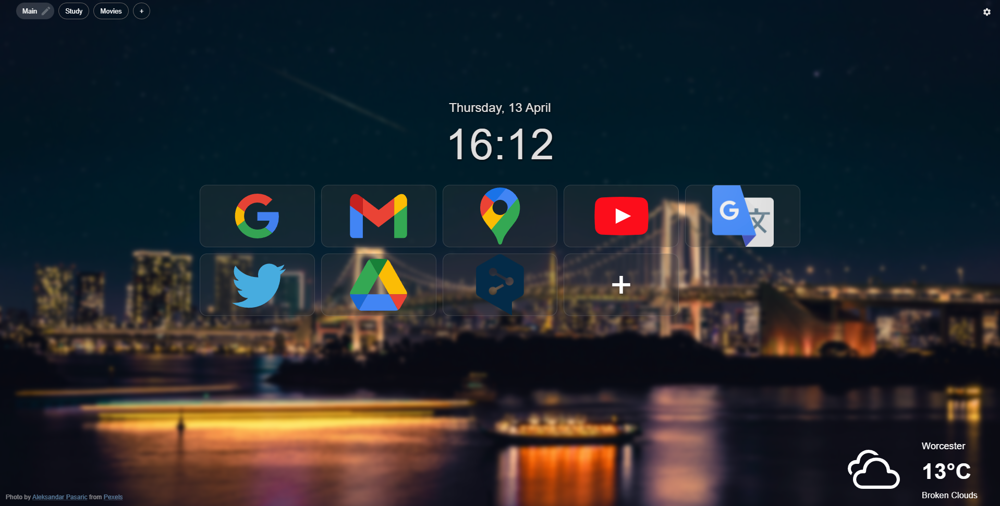
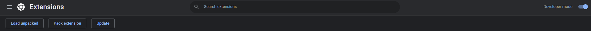

# Organizedly v0.2
Chrome extension thet replaces your browser's startpage with new bookmarks page.
Allow you to save, edit and delete new bookmarks, their titles, images, urls and sort bokmarks by groups.

## Installation
Unarchive folder everywhere on your PC, go to chrome extension page (chrome://extensions/) and toggle developer mode. After that press 'Load unpacked' button and choose path to uarchived folder

## Libraries Used

 - [React](https://www.npmjs.com/package/react)
 - [Dexie](https://www.npmjs.com/package/dexie)
 - [dexie-react-hooks](https://www.npmjs.com/package/dexie-react-hooks)
 - [MUI](https://www.npmjs.com/package/@mui/material)
 - [dayjs](https://www.npmjs.com/package/dayjs)